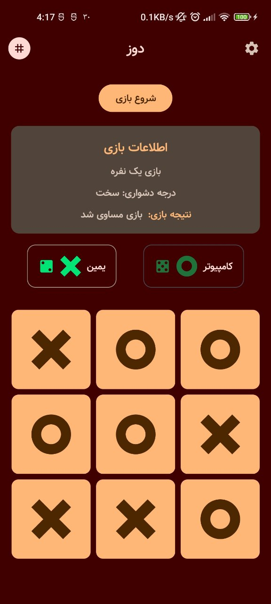

# Dooz/Tic-Tac-Tao **(WIP)**

Dooz or Tic-Tac-Tao is a simple pen and paper game. This implementation is created using Kotlin and
Jetpack compose for Android devices.

---

| Icon |                Item                 |
|:----:|:-----------------------------------:|
|  📺  |       [**Preview**](#Preview)       |
|  📱  | [**Compatibility**](#Compatibility) |
|  💻  |         [**Usage**](#Usage)         |
|  📩  |      [**Download**](#Download)      |
|  📋  |      [**Features**](#Features)      |
|  🧾  |     [**Changelog**](#Changelog)     |
|  ⚖️  |       [**License**](#License)       |

---

## Preview

## Compatibility

**SDK21+** or **Android 5.0+**

## Usage

## Download

- GitHub releases: [here](https://github.com/yamin8000/Dooz/releases)
- Bazaar: [here](https://cafebazaar.ir/app/io.github.yamin8000.dooz)

## Features

## Changelog

- WIP

## License

> Owl is licensed under the **[GNU General Public License v3.0](./LICENSE)**  
> Permissions of this strong copyleft license are conditioned on making  
> available complete source code of licensed works and modifications,  
> which include larger works using a licensed work, under the same  
> license. Copyright and license notices must be preserved. Contributors  
> provide an express grant of patent rights.
